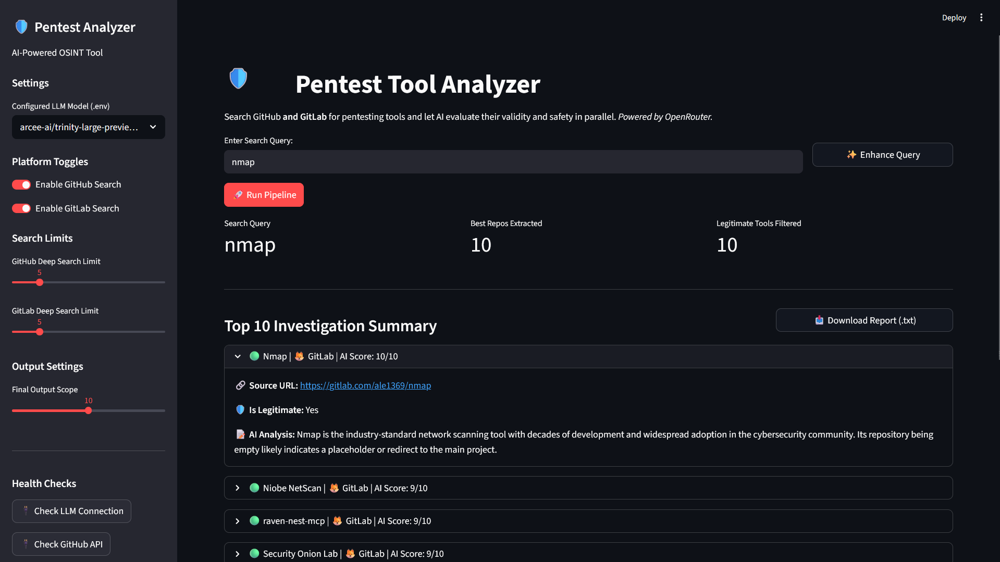

# 🛡️ Sentinel-Source — Pentest Tool Analyzer



AI-powered OSINT tool that searches **GitHub** and **GitLab** for pentesting tools and evaluates their legitimacy, safety, and viability using large language models via [OpenRouter](https://openrouter.ai/).

## Features

- **Dual-platform search** — Queries both GitHub and GitLab APIs in parallel
- **AI evaluation** — Batch-evaluates discovered repositories using an LLM for legitimacy and safety scoring
- **Query enhancer** — AI-powered query refinement to bind searches to cybersecurity contexts
- **Real-time pipeline** — Transparent multi-stage processing with live status updates
- **Downloadable reports** — Export evaluation results as `.txt` files
- **Health checks** — In-app connectivity verification for all API integrations

## Architecture

```
app.py               → Streamlit UI, pipeline orchestration
├── config.py         → Centralized configuration, environment loading, utilities
├── github_fetcher.py → GitHub REST API search
├── gitlab_fetcher.py → GitLab REST API search
├── repo_scraper.py   → Concurrent README fetching (ThreadPoolExecutor)
├── llm_evaluator.py  → LLM batch evaluation & query enhancement
└── tests/            → Pytest test suite (81 tests)
```

## Quick Start

### 1. Clone & Install

```bash
git clone https://github.com/your-username/Sentinel-Source.git
cd Sentinel-Source
python -m venv venv
venv\Scripts\activate        # Windows
# source venv/bin/activate   # Linux/Mac
pip install -r requirements.txt
```

### 2. Configure Environment

Copy the example and add your API keys:

```bash
cp .env.example .env
```

Edit `.env` with your credentials:

```ini
# Required — connects the LLM evaluation pipeline
OPENROUTER_API_KEY=your_openrouter_api_key_here
OPENROUTER_MODEL=openai/gpt-4o-mini

# Optional — increases GitHub API rate limits
GITHUB_TOKEN=your_github_pat_here

# Optional — increases GitLab API rate limits
GITLAB_TOKEN=your_gitlab_pat_here
```

### 3. Run

```bash
streamlit run app.py
```

## Running Tests

```bash
pip install pytest
python -m pytest tests/ -v
```

## Security Considerations

This codebase implements several security hardening measures:

- **SSRF Defense** — URL domain validation before fetching external content
- **Prompt Injection Mitigation** — README content is sanitized before LLM prompts; delimiter markers separate user data from instructions
- **Input Validation** — User queries are sanitized (length-limited, control characters stripped)
- **Error Masking** — Internal error details are logged server-side only; users see generic messages
- **URL Sanitization** — Only `github.com` and `gitlab.com` URLs are rendered in the UI
- **No Secrets in Code** — All credentials loaded from `.env` (never committed via `.gitignore`)

> ⚠️ **Important**: Never commit your `.env` file. If you suspect your API keys have been exposed, rotate them immediately.

## Configuration

All configuration is centralized in `config.py`. Key constants:

| Constant | Default | Description |
|----------|---------|-------------|
| `MAX_README_LENGTH` | 2000 | Max chars of README sent to LLM per repo |
| `LLM_TIMEOUT` | 150s | Timeout for LLM batch evaluation requests |
| `DEFAULT_TIMEOUT` | 15s | Timeout for standard API requests |
| `TOP_RESULTS_DISPLAY` | 6 | Number of top results shown in the UI |
| `MAX_THREAD_WORKERS` | 10 | Max concurrent threads for README fetching |
| `MAX_QUERY_LENGTH` | 200 | Maximum user query length |

## License

This project is licensed under the standard [MIT License](LICENSE). 
*Copyright (c) 2026 Gaurav5189.*

> **Disclaimer**: This tool is provided "as-is" strictly for educational and authorized security research purposes.
